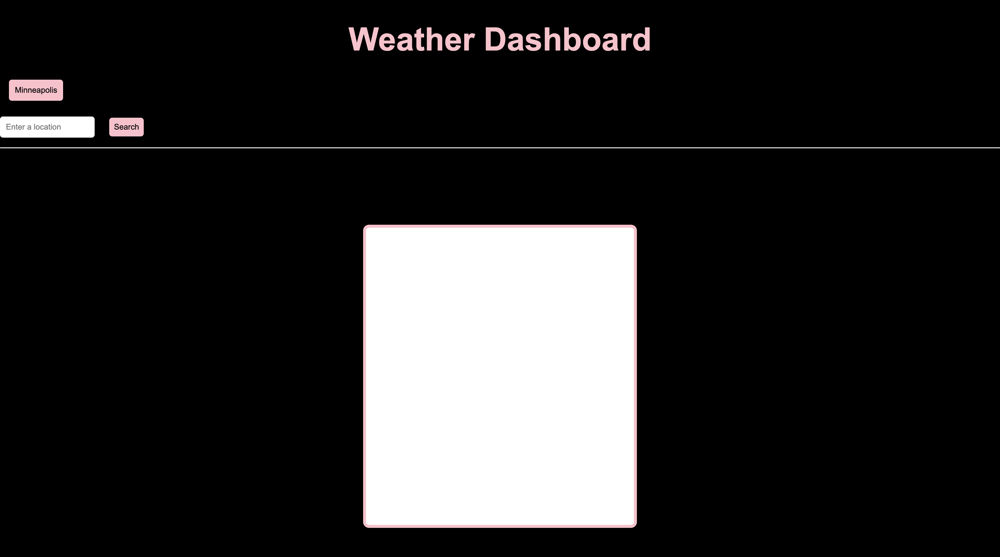

# WeatherDashboard

## Description

The weatherdash is a web browser weather api that has location, weather temperature, wind speed, and humidity outisde depending on what cities you search. The page has local storage that save your input of the city you search into a new button that could return to (It isn't currently working). It also have icons deplaying the type of weather it is outisde like sunny, rainy, cloudy, etc.

- [Installation](#installation)
- [Usage](#usage)
- [Credits](#credits)
- [License](#license)

## Installation

I used the tools that I had on my computer, like Git, Vscode, Github, and Google. First, I cloned the repo into my local file, made a GitHub repo, and named both the local and global repo. I opened the file in my VScode and started coding the project, and used Chrome developer tools to live to check the website for errors and stuff. Then I push it into my GitHub for deployment.

## Usage

## Credits

resources:
https://www.educative.io/answers/how-to-set-border-opacity-in-css

https://www.youtube.com/watch?v=cRIDN_eNqkU

https://javascript.plainenglish.io/build-a-real-time-weather-app-with-javascript-and-openweathermap-api-bcf8111df1fe

## License

MIT License

## Deployed
https://simplyannzz.github.io/WeatherDashboard/
## contact me

email: anniebui0110@gmail.com
github: https://github.com/simplyannzz
